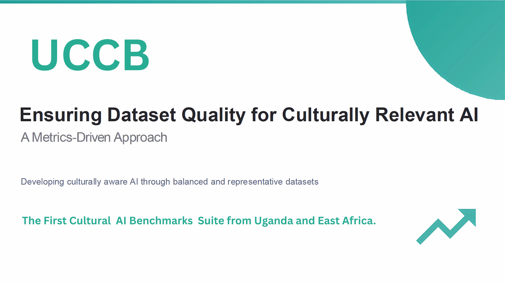

<div align="center">
  
</div>

# Ugandan Cultural Context Benchmark (UCCB) Suite

The Ugandan Cultural Context Benchmark (UCCB) Suite is the first comprehensive question-answering dataset designed to evaluate the cultural understanding and reasoning abilities of Large Language Models (LLMs) concerning Uganda's multifaceted environment.

## 🎯 Overview

The UCCB was created to address a critical gap in global evaluation suites, which often lack the specificity to assess an AI's true competence in localized contexts. This benchmark provides a reliable instrument for measuring a model's knowledge of Ugandan history, its grasp of linguistic nuances, its appreciation of artistic expressions, and its understanding of complex social dynamics.

## 📊 Dataset

The dataset is available on HuggingFace Hub: **[CraneAILabs/UCCB](https://huggingface.co/datasets/CraneAILabs/UCCB)**

```python
from datasets import load_dataset

# Load the dataset
dataset = load_dataset("CraneAILabs/UCCB")
```

### Dataset Statistics
- **Total Examples**: 1,039 question-answer pairs
- **Categories**: 24 cultural domains
- **Split**: Test set (evaluation benchmark)

## 🏛️ Cultural Domains

The benchmark covers 24 distinct categories providing broad and deep coverage of Ugandan culture:

1. Architecture
2. Attires & Dress Culture  
3. Customs
4. Demographics
5. Economy
6. Education
7. Festivals
8. Folklore
9. Food and Culinary Practices
10. Geography
11. History
12. Language
13. Literature
14. Media
15. Music
16. Notable Key Figures
17. Religion
18. Slang & Local Expressions
19. Sports
20. Streetlife
21. Traditions & Rituals
22. Ugandan Herbs
23. Value Addition
24. Values & Social Norms

## 🔧 Usage

### Quick Start

```python
from datasets import load_dataset

# Load the UCCB dataset
dataset = load_dataset("CraneAILabs/UCCB")

# Access test examples
test_data = dataset["test"]

# Example usage
for example in test_data.select(range(5)):
    print(f"Category: {example['category']}")
    print(f"Question: {example['question']}")
    print(f"Answer: {example['answer']}")
    print("-" * 50)
```

### LLM-as-a-Judge Evaluation

This repository includes an evaluation script that uses an "LLM-as-a-Judge" approach to assess model performance:

```bash
# Install dependencies
pip install openai datasets tqdm

# Set your API key
export OPENAI_API_KEY="your_openai_api_key"

# Run evaluation
python evaluate.py
```

## 📋 Evaluation Framework

The evaluation uses GPT-4o as a judge to score model responses on a scale of 1-5 based on:
- **Factual Accuracy**: Correctness against authoritative sources
- **Cultural Authenticity**: Genuine representation of Ugandan context
- **Clarity**: Quality of response formulation
- **Completeness**: Comprehensive coverage of the question

## 🛠️ Setting Up Your Model

To evaluate your own model, modify the `get_model_response` function in `evaluate.py`:

```python
def get_model_response(question: str, client: OpenAI) -> str:
    # Replace this with your model's inference logic
    # Examples:
    
    # For local models:
    # response = your_model.generate(question)
    # return response
    
    # For API-based models:
    # response = your_api_client.complete(prompt=question)
    # return response.text
    
    pass  # Your implementation here
```

## 📈 Results Format

The evaluation produces detailed JSON output with:
- Individual question scores and justifications
- Category-wise performance breakdown
- Overall benchmark score
- Qualitative feedback for error analysis

## 🏆 Leaderboard

A public leaderboard for the UCCB Suite is planned. Results will showcase model performance across different categories and provide insights into cultural competency.

## 📚 Citation

If you use the UCCB dataset in your research, please cite:

```bibtex
@misc{uccb_2025,
  author    = {Lwanga Caleb and Gimei Alex and Kavuma Lameck and Kato Steven Mubiru and Roland Ganafa and Sibomana Glorry and Atuhaire Collins and JohnRoy Nangeso and Bronson Bakunga},
  title     = {The Ugandan Cultural Context Benchmark (UCCB) Suite},
  year      = {2025},
  url       = {https://huggingface.co/datasets/CraneAILabs/UCCB}
}
```

## 📄 License

This dataset is licensed under the Creative Commons Attribution-NonCommercial-ShareAlike 4.0 International (CC BY-NC-SA 4.0).

## 🤝 Contributing

We welcome contributions to improve the benchmark. Please see our contribution guidelines for more information.

## 📞 Contact

For questions or collaboration opportunities, please reach out to the Crane AI Labs team.

---

**Links:**
- 🤗 [Dataset on HuggingFace](https://huggingface.co/datasets/CraneAILabs/UCCB)
- 💻 [GitHub Repository](https://github.com/Crane-AI-Labs/UCCB)
- 🏢 [Crane AI Labs](https://github.com/Crane-AI-Labs)